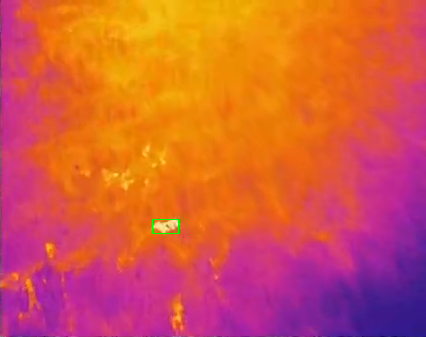
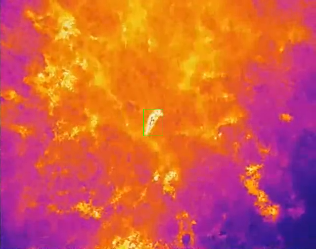
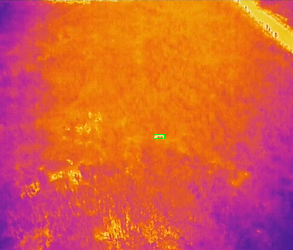
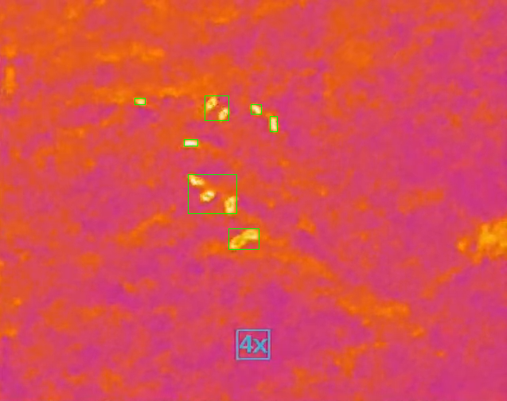

# シカのトレースについて

[YouTube](https://youtu.be/e-enwk27O7Y)で公開されていた日中22度のドローンサーモカメラ映像を入力とし，イノシシの自動検出処理を試験的に実装しました  
（見づらいですが緑の枠で囲んでいる部分です）

## 実装概要

- 画像中の最も高温な画素座標に基づきイノシシ領域を特定
- イノシシ領域をマスク処理し再帰的に検出処理を行うことで複数頭のイノシシ検出が可能
- 現段階の実装では特別な閾値は不要
- 改善事項
  - ノイズ除去処理や解像度変更などの前処理により精度改善の余地あり
  - サーモカメラの入力を直接利用できればより詳細な検出が期待できる

## シカ検出手段

- サーモカメラ
  - シカ以外の高温オブジェクトに対してはサーモカメラのみで識別が困難
    - 日中は可視光カメラと組み合わせて識別（後述）
  - 気温が検出精度に与える影響の程度は不明

- 可視光カメラ
  - YOLO，U-Net等オブジェクト検出手法
    - 学習データの必要量が不明であるため，検出精度の見通しが立たない
    - 季節，気候，植生によって背景にばらつきがあり，学習データが膨大になる可能性
  - 学習データが少ない場合，上記手順で高温領域を切り出し個別にクラス分類を行うほうが良いかも

## 要確認事項

- **サンプル画像** ← 欲しい
- 想定稼働時期，気候，地域
- 検出・分類対象（シカ，人，その他...？）
- 複数頭のシカに対する必要検出精度  
  （上記方法だと極度に群れているイノシシは個別の検出が困難）
